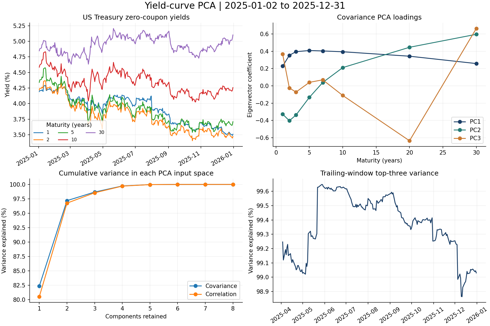

# Yield-Curve PCA & Portfolio Risk

An independent Python implementation of Treasury yield-curve principal component analysis and static bond portfolio risk. Maintained by **Somya Harjai** ([sharjai-code](https://github.com/sharjai-code)).

The research asks how much daily yield-curve variation can be described by a small factor set, how stable those factors are, and how well their shocks describe the interest-rate risk of a hypothetical bond portfolio.



## Research scope

- Covariance and correlation PCA on daily absolute yield changes, measured in basis points.
- Factor loadings, cumulative explained variance, and reconstruction errors.
- Chronological holdout reconstruction with training-only means, scales, and eigenvectors.
- Circular moving-block bootstrap intervals for variance shares and pointwise loadings.
- Trailing-window PCA with factor matching, cosine similarity, and subspace angles.
- Log-discount-factor interpolation, coupon-bond valuation, and key-rate DV01.
- Parallel, steepening, and PCA scenarios evaluated with linear sensitivities and full repricing.

## Snapshot results

The bundled Federal Reserve Gürkaynak–Sack–Wright (GSW) zero-coupon dataset covers **2025**. Selecting eight maturities (1, 2, 3, 5, 7, 10, 20, and 30 years) leaves **249 complete curves** and **248 daily changes**.

| Diagnostic | Result |
|---|---:|
| Top-three covariance PCA share | 98.68% |
| Top-three correlation PCA share | 98.55% |
| Covariance top-three share, 95% block-bootstrap interval | 98.44%–99.23% |
| Training / holdout changes | 198 / 50 |
| Hypothetical portfolio value | $3,858,203 |
| Parallel DV01 | $2,857 per bp |

Covariance and correlation variance shares use different input spaces. Raw-bp reconstruction errors provide a common comparison. These are sample-specific results, not evidence of forecastability or trading profits.

See the [research report](results/research_report.md), [machine-readable summary](results/summary.json), and [notebook](notebooks/yield_curve_research.ipynb).

## Quick start

Run these commands from the repository root with Python 3.10 or later:

```bash
python -m venv .venv
source .venv/bin/activate
python -m pip install -e .
python -m yield_curve_pca.analysis
python -m unittest discover -s tests -v
```

On Windows, activate with `.venv\Scripts\activate`. The default run uses the bundled data and needs no API key or internet access. It rebuilds the tables, figures, and Markdown report in `results/`.

For Jupyter:

```bash
python -m pip install -e '.[notebook]'
jupyter lab notebooks/yield_curve_research.ipynb
```

To analyze a longer period using the current GSW vintage:

```bash
python -m yield_curve_pca.analysis --download --data data/gsw_full.csv --start 2006-02-09 --end 2020-03-10 --window 252 --output results/historical
```

This historical command is provided for further research; its download and numerical output were not verified in the initial build because the execution environment blocked direct access to the Fed CSV. If automated download is blocked on your network, download the [GSW CSV](https://www.federalreserve.gov/data/yield-curve-tables/feds200628.csv) manually to `data/gsw_full.csv` and omit `--download`.

The longer-period analysis uses the GSW dataset, different maturities, and different portfolio assumptions from the original dissertation, so it should not be expected to reproduce its numerical results.

## Methodology

Let `X` contain daily yield changes in bp. Covariance PCA uses centered `X`; correlation PCA also divides each maturity by its sample standard deviation. Singular values are converted into covariance eigenvalues using `s² / (n−1)`.

PCA factor signs are arbitrary. For display, the largest absolute coefficient is oriented positively. Rolling and bootstrap comparisons additionally match factor order and sign to a reference basis. Economic labels such as level, slope, and curvature are interpretations to inspect rather than enforced identities.

For correlation PCA, the raw-bp factor basis multiplies the eigenvectors by the training standard deviations. Reconstructed yield changes restore the training mean before evaluating errors or linear P&L.

GSW `SVENYXX` series are continuously compounded zero-coupon yields in percent. Bond cashflows use `D(t) = exp(−y(t)t)` with decimal yields. Interpolation is linear in log discount factors with `D(0)=1`; there is no extrapolation beyond 30 years. The origin-to-one-year segment imposes a flat zero rate below one year.

The illustrative portfolio has $1m face each of 2-, 5-, 10-, and 30-year regular-coupon bonds, all paying 4% semiannually. Valuation is on a coupon date with no accrued interest. Positive DV01 measures the dollar benefit of a 1 bp yield decrease. Therefore, the first-order P&L for a positive yield shock is `−DV01 · shock_bp`.

The 20% chronological holdout evaluates contemporaneous reconstruction of **observed** yield changes using a frozen earlier fit. Historical shocks are applied to a fixed latest-date portfolio curve and cashflow schedule. This is a static risk study, not a return forecast or realized trading backtest.

## Data and reproducibility

- Data source: [Federal Reserve Board, Nominal Yield Curve](https://www.federalreserve.gov/data/nominal-yield-curve.htm).
- The 2025 snapshot was extracted from the Fed's [public HTML table](https://www.federalreserve.gov/data/yield-curve-tables/feds200628_1.html) on October 4, 2026. Missing-date rows remain in the raw snapshot and are removed before differencing; no temporal filling is used.
- Dataset vintage, extraction details, and file hash are recorded in [data provenance](data/PROVENANCE.json).
- Numerical output, seed, configuration, input hash, and package versions are recorded in `results/summary.json`.
- The numerical test suite checks eigenvalues, orthogonality, basis-point units, raw-space reconstruction, causal rolling windows, coupon valuation, and analytic zero-coupon DV01.
- GitHub Actions is configured to run the checks and an offline analysis. It has not run on GitHub before publication.

## Structure

| Path | Purpose |
|---|---|
| `src/yield_curve_pca/data.py` | Data parsing, download, and basis-point changes |
| `src/yield_curve_pca/pca.py` | SVD PCA, bootstrap, factor matching, rolling diagnostics |
| `src/yield_curve_pca/curves.py` | Discount curves, coupon cashflows, valuation, DV01 |
| `src/yield_curve_pca/analysis.py` | Reproducible analysis, stress tests, plots, report |
| `notebooks/` | Research walkthrough with executed numerical output |
| `data/` | Public GSW snapshot and provenance |
| `results/` | Generated figures, tables, report, and run metadata |
| `tests/` | Numerical and data-integrity checks |

## Attribution and contribution

This project is inspired by **Andrea Ranzato's** [pca-yield-curve-modelling](https://github.com/andreranza/pca-yield-curve-modelling). It is a methodological adaptation written independently in Python. The upstream code, dissertation text, and figures have not been copied into this repository.

This implementation uses GSW zero-coupon data, an illustrative coupon-bond portfolio, chronological holdout evaluation, dependent bootstrap sampling, and rolling factor diagnostics. Those choices differ from the upstream dissertation. Development was assisted by ChatGPT; the maintainer is responsible for reviewing the methodology and any claims made about the project. See [CONTRIBUTIONS.md](CONTRIBUTIONS.md).

References:

- Ranzato, Andrea (2020). *Yield Curve Modelling with PCA for Market Risk Assessment*, linked above.
- Gürkaynak, Refet S., Brian Sack, and Jonathan H. Wright (2007). *The U.S. Treasury Yield Curve: 1961 to the Present*, Journal of Monetary Economics, 54(8), 2291–2304. [Federal Reserve working paper](https://www.federalreserve.gov/econres/feds/the-us-treasury-yield-curve-1961-to-the-present.htm).
- Litterman, Robert, and José Scheinkman (1991). *Common Factors Affecting Bond Returns*, Journal of Fixed Income, 1(1), 54–61.

## Limits

The bundled one-year sample is short and cannot establish stability across market regimes. Longer samples and alternative block lengths should be investigated. Pointwise bootstrap intervals can become unreliable near tied eigenvalues. Valuation omits accrued interest, settlement conventions, bid-ask costs, funding costs, and instrument-specific details. Treasury rate factors do not measure corporate-credit default, spread, or liquidity risk.
